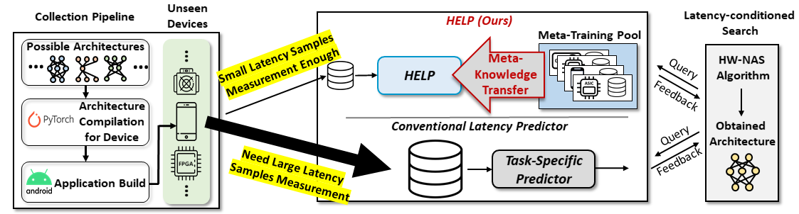

# [**NeurIPS 2021 Spotlight**] HELP: Hardware-adaptive Efficient Latency Prediction for NAS via Meta-Learning [[Paper]](https://arxiv.org/abs/2106.08630)
This is Official **PyTorch implementation** for HELP: Hardware-adaptive Efficient Latency Prediction for NAS via Meta-Learning.

```
@inproceedings{lee2021help,
    title     = {HELP: Hardware-Adaptive Efficient Latency Prediction for NAS via Meta-Learning},
    author    = {Lee, Hayeon and Lee, Sewoong and Chong, Song and Hwang, Sung Ju},
    booktitle = {Advances in Neural Information Processing Systems (NeurIPS)},
    year      = {2021}
} 
```

## Overview

For deployment, neural architecture search should be hardware-aware, in order to satisfy the device-specific constraints (e.g., memory usage, latency and energy consumption) and enhance the model efficiency. Existing methods on hardware-aware NAS collect a large number of samples (e.g., accuracy and latency) from a target device, either builds a lookup table or a latency estimator. However, such approach is impractical in real-world scenarios as there exist numerous devices with different hardware specifications, and collecting samples from such a large number of devices will require prohibitive computational and monetary cost. To overcome such limitations, we propose Hardware-adaptive Efficient Latency Predictor (HELP), which formulates the device-specific latency estimation problem as a meta-learning problem, such that we can estimate the latency of a model's performance for a given task on an unseen device with a few samples. To this end, we introduce novel hardware embeddings to embed any devices considering them as black-box functions that output latencies, and meta-learn the hardware-adaptive latency predictor in a device-dependent manner, using the hardware embeddings. We validate the proposed HELP for its latency estimation performance on unseen platforms, on which it achieves high estimation performance with as few as 10 measurement samples, outperforming all relevant baselines. We also validate end-to-end NAS frameworks using HELP against ones without it, and show that it largely reduces the total time cost of the base NAS method, in latency-constrained settings. 

## Prerequisites
- Python 3.8 (Anaconda)
- PyTorch 1.8.1
- CUDA 10.2

Hardware spec used for meta-training the proposed HELP model
- GPU: A single Nvidia GeForce RTX 2080Ti
- CPU: Intel(R) Xeon(R) Silver 4114 CPU @ 2.20GHz

## Installation
```
$ conda create --name help python=3.8
$ conda activate help
$ conda install pytorch==1.8.1 torchvision cudatoolkit=10.2 -c pytorch
$ pip install nas-bench-201
$ pip install tqdm
$ conda install scipy
$ conda install pyyaml
$ conda install tensorboard
```
## Contents
[1. Experiments on NAS-Bench-201 Search Space](https://github.com/HayeonLee/HELP#1-reproduce-main-results-on-nas-bench-201-search-space)

[2. Experiments on FBNet Search Space](https://github.com/HayeonLee/HELP#2-reproduce-main-results-on-fbnet-search-space)

[3. Experiments on OFA Search Space](https://github.com/HayeonLee/HELP#3-reproduce-main-results-on-ofa-search-space) 

[4. Experiments on HAT Search Space](https://github.com/HayeonLee/HELP#4-main-results-on-hat-search-space)

## 1. Reproduce Main Results on NAS-Bench-201 Search Space
We provide the code to reproduce the main results on NAS-Bench-201 search space as follows:
- Computing architecture ranking correlation between latencies estimated by HELP and true measured latencies on unseen devices (Table 3).
- Latency-constrained NAS Results with MetaD2A + HELP on unseen devices (Table 4).
- Meta-Training HELP model.

### 1.1. Data Preparation and Model Checkpoint
We include all required datasets and checkpoints in this github repository. 

### 1.2. [Meta-Test] Architecture ranking correlation
You can compute architecture ranking correlation between latencies estimated by HELP and true measured latencies on unseen devices on NAS-Bench-201 search space (Table 3):

```
$ python main.py --search_space nasbench201 \
		 --mode 'meta-test' \
		 --num_samples 10 \
		 --num_meta_train_sample 900 \
                 --load_path [Path of Checkpoint File] \
		 --meta_train_devices '1080ti_1,1080ti_32,1080ti_256,silver_4114,silver_4210r,samsung_a50,pixel3,essential_ph_1,samsung_s7' \
		 --meta_valid_devices 'titanx_1,titanx_32,titanx_256,gold_6240' \                 
                 --meta_test_devices 'titan_rtx_256,gold_6226,fpga,pixel2,raspi4,eyeriss' 
```

You can use checkpoint file provided by this git repository `./data/nasbench201/checkpoint/help_max_corr.pt` as follows:
```
$ python main.py --search_space nasbench201 \
		 --mode 'meta-test' \
		 --num_samples 10 \
		 --num_meta_train_sample 900 \
                 --load_path './data/nasbench201/checkpoint/help_max_corr.pt' \
		 --meta_train_devices '1080ti_1,1080ti_32,1080ti_256,silver_4114,silver_4210r,samsung_a50,pixel3,essential_ph_1,samsung_s7' \
		 --meta_valid_devices 'titanx_1,titanx_32,titanx_256,gold_6240' \                 
                 --meta_test_devices 'titan_rtx_256,gold_6226,fpga,pixel2,raspi4,eyeriss' 
```
or you can use provided script:
```
$ bash script/run_meta_test_nasbench201.sh [GPU_NUM]
```

__Architecture Ranking Correlation Results (Table 3)__
|          Method         	| # of Training Samples <br> From Target Device 	| Desktop GPU <br> (Titan RTX Batch 256) 	| Desktop CPU <br> (Intel Gold 6226)	| Mobile <br> Pixel2 	|   Raspi4  	|    ASIC   	|    FPGA   	|    Mean   	|
|:-----------------------:	|:-----------------------------------:	|:-----------:	|:-----------:	|:-------------:	|:---------:	|:---------:	|:---------:	|:---------:	|
|          FLOPS          	|                  -                  	|    0.950    	|    0.826    	|     0.765     	|   0.846   	|   0.437   	|   0.900   	|   0.787   	|
|   Layer-wise Predictor  	|                  -                  	|    0.667    	|    0.866    	|       -       	|     -     	|     -     	|     -     	|   0.767   	|
|         BRP-NAS         	|                 900                 	|    0.814    	|    0.796    	|     0.666     	|   0.847   	|   0.811   	|   0.801   	|   0.789   	|
| BRP-NAS <br> (+extra samples) 	|                 3200                	|    0.822    	|    0.805    	|     0.693     	|   0.853   	|   0.830   	|   0.828   	|   0.805   	|
|     **HELP (Ours)**     	|                **10**               	|  **0.987**  	|  **0.989**  	|   **0.802**   	| **0.890** 	| **0.940** 	| **0.985** 	| **0.932** 	|

### 1.3. [Meta-Test] Efficient Latency-constrained NAS combined with MetaD2A
You can reproduce latency-constrained NAS results with **MetaD2A + HELP** on unseen devices on NAS-Bench-201 search space (Table 4):

```
$ python main.py --search_space nasbench201 --mode 'nas' \
                 --load_path [Path of Checkpoint File] \
                 --sampled_arch_path 'data/nasbench201/arch_generated_by_metad2a.txt' \
                 --nas_target_device [Device] \ 
                 --latency_constraint [Latency Constraint] 
```
For example, if you use checkpoint file provided by this git repository, then path of checkpoint file is `./data/nasbench201/checkpoint/help_max_corr.pt`, if you set target device as CPU Intel Gold 6226 (`gold_6226`) with batch size 256 and target latency constraint as 11.0 (ms), command is as follows:
```
$ python main.py --search_space nasbench201 --mode 'nas' \
                 --load_path './data/nasbench201/checkpoint/help_max_corr.pt' \
                 --sampled_arch_path 'data/nasbench201/arch_generated_by_metad2a.txt' \
                 --nas_target_device gold_6226 \ 
                 --latency_constraint 11.0 
```
or you can use provided script:
```
$ bash script/run_nas_metad2a.sh [GPU_NUM]
```

__Efficient Latency-constrained NAS Results (Table 4)__

|                        Device                       	| # of Training Samples <br> from Target Device 	|  Latency <br> Constraint (ms) 	|     Latency <br> (ms)    	|     Accuracy <br> (%)    	| Neural Architecture <br> Config 	|
|:---------------------------------------------------:	|:------------------------------:	|:----------------------------:	|:------------------------:	|:------------------------:	|:------------------------:	|
| GPU Titan RTX <br> (Batch 256) <br> `titan_rtx_256` 	|               10               	|   18.0 <br> 21.0 <br> 25.0   	| 17.8 <br> 18.9 <br> 24.2 	| 69.7 <br> 71.5 <br> 71.8 	| [link](https://github.com/HayeonLee/HELP/blob/main/data/nasbench201/architecture_config/titan_rtx_256/latency_17.8ms_accuracy_69.7.txt) <br> [link](https://github.com/HayeonLee/HELP/blob/main/data/nasbench201/architecture_config/titan_rtx_256/latency_18.9ms_accuracy_71.5.txt) <br> [link](https://github.com/HayeonLee/HELP/blob/main/data/nasbench201/architecture_config/titan_rtx_256/latency_24.2ms_accuracy_71.8.txt) 	|
|         CPU Intel Gold 6226 <br> `gold_6226`        	|               10               	|    8.0 <br> 11.0 <br> 14.0   	|  8.0 <br> 10.7 <br> 14.3 	| 67.3 <br> 70.2 <br> 72.1 	| [link](https://github.com/HayeonLee/HELP/blob/main/data/nasbench201/architecture_config/gold_6226/latency_8.0ms_accuracy_67.3.txt) <br> [link](https://github.com/HayeonLee/HELP/blob/main/data/nasbench201/architecture_config/gold_6226/latency_10.7ms_accuracy_70.2.txt) <br> [link](https://github.com/HayeonLee/HELP/blob/main/data/nasbench201/architecture_config/gold_6226/latency_14.3ms_accuracy_72.1.txt) 	|
|             Mobile Pixel2 <br> `pixel2`             	|               10               	|   14.0 <br> 18.0 <br> 22.0   	| 13.0 <br> 19.0 <br> 25.0 	| 69.7 <br> 71.8 <br> 73.2 	| [link](https://github.com/HayeonLee/HELP/blob/main/data/nasbench201/architecture_config/pixel2/latency_14.0ms_accuracy_69.7.txt) <br> [link](https://github.com/HayeonLee/HELP/blob/main/data/nasbench201/architecture_config/pixel2/latency_18.0ms_accuracy_71.8.txt) <br> [link](https://github.com/HayeonLee/HELP/blob/main/data/nasbench201/architecture_config/pixel2/latency_25.0ms_accuracy_73.2.txt) 	|
|             ASIC-Eyeriss <br> `eyeriss`             	|               10               	|     5.0 <br> 7.0 <br> 9.0    	|   3.9 <br> 5.1 <br> 9.1  	| 71.5 <br> 71.8 <br> 73.5 	| [link](https://github.com/HayeonLee/HELP/blob/main/data/nasbench201/architecture_config/asic-eyeriss/latency_3.9ms_accuracy_71.5.txt) <br> [link](https://github.com/HayeonLee/HELP/blob/main/data/nasbench201/architecture_config/asic-eyeriss/latency_5.1ms_accuracy_71.8.txt) <br> [link](https://github.com/HayeonLee/HELP/blob/main/data/nasbench201/architecture_config/asic-eyeriss/latency_9.1ms_accuracy_73.5.txt) 	|
|                   FPGA <br> `fpga`                  	|               10               	|     4.0 <br> 5.0 <br> 6.0    	|   3.8 <br> 4.7 <br> 7.4  	| 70.2 <br> 71.8 <br> 73.5 	| [link](https://github.com/HayeonLee/HELP/blob/main/data/nasbench201/architecture_config/fpga/latency_3.8ms_accuracy_70.2.txt) <br> [link](https://github.com/HayeonLee/HELP/blob/main/data/nasbench201/architecture_config/fpga/latency_4.7ms_accuracy_71.8.txt) <br> [link](https://github.com/HayeonLee/HELP/blob/main/data/nasbench201/architecture_config/fpga/latency_7.4ms_accuracy_73.5.txt) 	|

### 1.4. Meta-Training HELP model
Note that this process is performed **only once** for all NAS results.
```
$ python main.py --search_space nasbench201 \
                 --mode 'meta-train' \
                 --num_samples 10 \
                 --num_meta_train_sample 900 \
                 --meta_train_devices '1080ti_1,1080ti_32,1080ti_256,silver_4114,silver_4210r,samsung_a50,pixel3,essential_ph_1,samsung_s7' \
                 --meta_valid_devices 'titanx_1,titanx_32,titanx_256,gold_6240' \           
                 --meta_test_devices 'titan_rtx_256,gold_6226,fpga,pixel2,raspi4,eyeriss' \
                 --exp_name [EXP_NAME] \
                 --seed 3 # e.g.) 1, 2, 3
```
or you can use provided script:
```
$ bash script/run_meta_training_nasbench201.sh [GPU_NUM]
```


The results (checkpoint file, log file etc) are saved in 
```
./results/nasbench201/[EXP_NAME]
```

## 2. Reproduce Main Results on FBNet Search Space
We provide the code to reproduce the main results on FBNet search space as follows:
- Computing architecture ranking correlation between latencies estimated by HELP and true measured latencies on unseen devices (Table 2).
- Meta-Training HELP model.

### 2.1. Data Preparation and Model Checkpoint
We include all required datasets and checkpoints in this github repository. 

### 2.2. [Meta-Test] Architecture ranking correlation
You can compute architecture ranking correlation between latencies estimated by HELP and true measured latencies on unseen devices on FBNet search space (Table 2):
```
$ python main.py --search_space fbnet \
	--mode 'meta-test' \
	--num_samples 10 \
	--num_episodes 4000 \
	--num_meta_train_sample 4000 \
	--load_path './data/fbnet/checkpoint/help_max_corr.pt' \
	--meta_train_devices '1080ti_1,1080ti_32,1080ti_64,silver_4114,silver_4210r,samsung_a50,pixel3,essential_ph_1,samsung_s7' \
	--meta_valid_devices 'titanx_1,titanx_32,titanx_64,gold_6240' \
	--meta_test_devices 'fpga,raspi4,eyeriss'
```
or you can use provided script:
```
$ bash script/run_meta_test_fbnet.sh [GPU_NUM]
```

__Architecture Ranking Correlation Results (Table 2)__

|      Method     	| Raspi4 	|  ASIC 	|  FPGA 	|  Mean 	|
|:---------------:	|:------:	|:-----:	|:-----:	|:-----:	|
|       MAML      	|  0.718 	| 0.763 	| 0.727 	| 0.736 	|
|     Meta-SGD    	|  0.821 	| 0.822 	| 0.776 	| 0.806 	|
| **HELP (Ours)** 	|  0.887 	| 0.943 	| 0.892 	| 0.910 	|


### 2.3. Meta-Training HELP model
Note that this process is performed **only once** for all results.

```
$ python main.py --search_space fbnet \
	--mode 'meta-train' \
	--num_samples 10 \
	--num_episodes 4000 \
	--num_meta_train_sample 4000 \
	--exp_name [EXP_NAME] \
	--meta_train_devices '1080ti_1,1080ti_32,1080ti_64,silver_4114,silver_4210r,samsung_a50,pixel3,essential_ph_1,samsung_s7' \
	--meta_valid_devices 'titanx_1,titanx_32,titanx_64,gold_6240' \
	--meta_test_devices 'fpga,raspi4,eyeriss' \
	--seed 3 # e.g.) 1, 2, 3
```

or you can use provided script:
```
$ bash script/run_meta_training_fbnet.sh [GPU_NUM]
```

The results (checkpoint file, log file etc) are saved in 
```
./results/fbnet/[EXP_NAME]
```

## 3. Reproduce Main Results on OFA Search Space
We provide the code to reproduce the main results on OFA search space as follows:
- Latency-constrained NAS Results with accuracy predictor of OFA + HELP on unseen devices (Table 5).
- Validating obatined neural architecture on ImageNet-1K.
- Meta-Training HELP model.

### 3.1. Data Preparation and Model Checkpoint
We include required datasets except ImageNet-1K, and checkpoints in this github repository. 
To validate obatined neural architecture on ImageNet-1K, you should download ImageNet-1K (2012 ver.)

### 3.2. [Meta-Test] Efficient Latency-constrained NAS combined with accuracy predictor of OFA
You can reproduce latency-constrained NAS results with **OFA + HELP** on unseen devices on OFA search space (Table 5):

```
python main.py \
	--search_space ofa \
	--mode nas \
	--num_samples 10 \
	--seed 3 \
	--num_meta_train_sample 4000 \
	--load_path './data/ofa/checkpoint/help_max_corr.pt' \
	--nas_target_device [DEVICE_NAME] \
	--latency_constraint [LATENCY_CONSTRAINT] \
	--exp_name 'nas' \
	--meta_train_devices '2080ti_1,2080ti_32,2080ti_64,titan_xp_1,titan_xp_32,titan_xp_64,v100_1,v100_32,v100_64' \
	--meta_valid_devices 'titan_rtx_1,titan_rtx_32' \
	--meta_test_devices 'titan_rtx_64' 
```

For example,
```
$ python main.py \
	--search_space ofa \
	--mode nas \
	--num_samples 10 \
	--seed 3 \
	--num_meta_train_sample 4000 \
	--load_path './data/ofa/checkpoint/help_max_corr.pt' \
	--nas_target_device titan_rtx_64 \
	--latency_constraint 20 \
	--exp_name 'nas' \
	--meta_train_devices '2080ti_1,2080ti_32,2080ti_64,titan_xp_1,titan_xp_32,titan_xp_64,v100_1,v100_32,v100_64' \
	--meta_valid_devices 'titan_rtx_1,titan_rtx_32' \
	--meta_test_devices 'titan_rtx_64' 
```

or you can use provided script:
```
$ bash script/run_nas_ofa.sh [GPU_NUM]
```

__Efficient Latency-constrained NAS Results (Table 5)__

|                        Device                 	| Sample from <br> Target Device 	|  Latency <br> Constraint (ms) 	|     Latency <br> (ms)    	|     Accuracy <br> (%)    	| Architecture <br> config 	|
|:---------------------------------------------------:	|:------------------------------:	|:----------------------------:	|:------------------------:	|:------------------------:	|:------------------------:	|
| GPU Titan RTX <br> (Batch 64)  	|               10              	|     20 <br> 23 <br> 28   	| 20.3 <br> 23.1 <br> 28.6 	| 76.0 <br> 76.8 <br> 77.9 	| [link](https://github.com/HayeonLee/HELP/blob/main/data/ofa/architecture_config/titan_rtx_64/latency_20.3ms_accuracy_76.0.json) <br>  [link](https://github.com/HayeonLee/HELP/blob/main/data/ofa/architecture_config/titan_rtx_64/latency_23.1ms_accuracy_76.8.json) <br> [link](https://github.com/HayeonLee/HELP/blob/main/data/ofa/architecture_config/titan_rtx_64/latency_28.6ms_accuracy_77.9.json) |
|         CPU Intel Gold 6226        	|               20               	|     170 <br> 190   	|  147 <br> 171 	| 77.6 <br> 78.1 | [link](https://github.com/HayeonLee/HELP/blob/main/data/ofa/architecture_config/gold_6226/latency_147ms_accuracy_77.6.json) <br> [link](https://github.com/HayeonLee/HELP/blob/main/data/ofa/architecture_config/gold_6226/latency_171ms_accuracy_78.1.json) |
|             Jetson AGX Xavier             	|               10               	|    65 <br> 70 | 67.4 <br> 76.4 | 75.9 <br> 76.4  	| [link](https://github.com/HayeonLee/HELP/blob/main/data/ofa/architecture_config/jetson_agx_xavier/latency_67.4ms_accuracy_75.9.json) <br> [link](https://github.com/HayeonLee/HELP/blob/main/data/ofa/architecture_config/jetson_agx_xavier/latency_76.4ms_accuracy_76.4.json)	|

### 3.3. Validating obtained neural architecture on ImageNet-1K
```
$ python validate_imagenet.py \
		--config_path [Path of neural architecture config file]
		--imagenet_save_path [Path of ImageNet 1k]
```
for example,
```
$ python validate_imagenet.py \
		--config_path 'data/ofa/architecture_config/gpu_titan_rtx_64/latency_28.6ms_accuracy_77.9.json' \
		--imagenet_save_path './ILSVRC2012'
```

### 3.4. Meta-training HELP model
Note that this process is performed **only once** for all results.
```
$ python main.py --search_space ofa \
		--mode 'meta-train' \
		--num_samples 10 \
		--num_meta_train_sample 4000 \
		--exp_name [EXP_NAME] \
                --meta_train_devices '2080ti_1,2080ti_32,2080ti_64,titan_xp_1,titan_xp_32,titan_xp_64,v100_1,v100_32,v100_64' \
                --meta_valid_devices 'titan_rtx_1,titan_rtx_32' \
                --meta_test_devices 'titan_rtx_64' \
		--seed 3 # e.g.) 1, 2, 3
```

or you can use provided script:
```
$ bash script/run_meta_training_ofa.sh [GPU_NUM]
```

## 4. Main Results on HAT Search Space
We provide the neural architecture configurations to reproduce the results of machine translation (WMT'14 En-De Task) on HAT search space.

__Efficient Latency-constrained NAS Results__
|     Task     	|          Device         	| Samples from <br> Target Device 	|        Latency       	|      BLEU score      	| Architecture <br>  Config 	|
|:------------:	|:-----------------------:	|:-------------------------------:	|:--------------------:	|:--------------------:	|:----------------------------------:	|
| [WMT'14 En-De](https://github.com/mit-han-lab/hardware-aware-transformers#data-preparation) 	|   GPU NVIDIA Titan RTX  	|                10               	|  74.0ms <br> 106.5ms 	|   27.19 <br> 27.44   	| [link](https://github.com/HayeonLee/HELP/blob/main/data/hat/wmt14ende_help_titanrtx%4074.0ms.yml) <br> [link](https://github.com/HayeonLee/HELP/blob/main/data/hat/wmt14ende_help_titanrtx%40106.5ms.yml)                   	|
|[WMT'14 En-De](https://github.com/mit-han-lab/hardware-aware-transformers#data-preparation) 	| CPU Intel Xeon Gold 6240 	|                10               	| 159.6ms <br> 343.2ms 	| 27.20 <br> 27.52<br> 	| [link](https://github.com/HayeonLee/HELP/blob/main/data/hat/wmt14ende_help_gold6240%40159.6ms.yml) <br> [link](https://github.com/HayeonLee/HELP/blob/main/data/hat/wmt14ende_help_gold6240%40343.2ms.yml)                   	|

You can test models by [BLEU score](https://github.com/mit-han-lab/hardware-aware-transformers#test-bleu-sacrebleu-score) and [Computing Latency](https://github.com/mit-han-lab/hardware-aware-transformers#test-latency-model-size-and-flops).


## Reference
[Model-Agnostic Meta-Learning for Fast Adaptation of Deep Networks](https://arxiv.org/abs/1703.03400) (ICML17)

[Meta-SGD: Learning to Learn Quickly for Few-Shot Learning](https://arxiv.org/abs/1707.09835)

[Once-for-All: Train One Network and Specialize it for Efficient Deployment](https://arxiv.org/abs/1908.09791) (ICLR20)

[NAS-Bench-201: Extending the Scope of Reproducible Neural Architecture Search](https://arxiv.org/abs/2001.00326) (ICLR20)

[BRP-NAS: Prediction-based NAS using GCNs](https://arxiv.org/abs/2007.08668) (NeurIPS20)

[HAT: Hardware Aware Transformers for Efficient Natural Language Processing](https://arxiv.org/abs/2005.14187) (ACL20)

[Rapid Neural Architecture Search by Learning to Generate Graphs from Datasets](https://arxiv.org/abs/2107.00860) (ICLR21)

[HW-NAS-Bench: Hardware-Aware Neural Architecture Search Benchmark](https://openreview.net/forum?id=_0kaDkv3dVf) (ICLR21)


